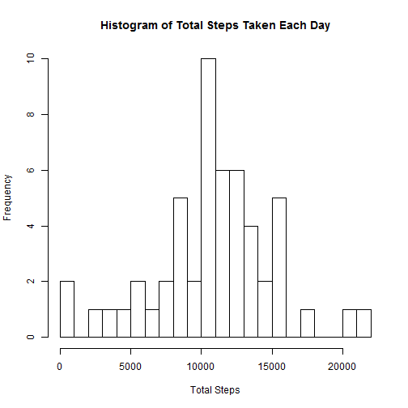
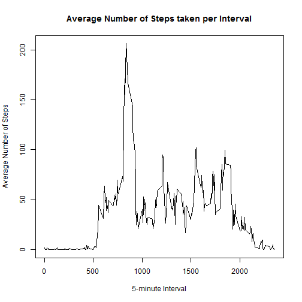
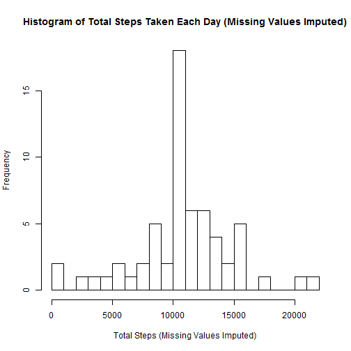
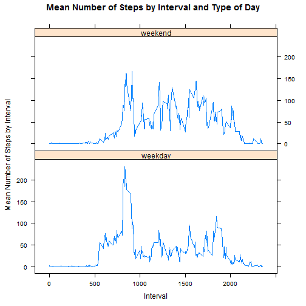

#Peer Assessment 1
by RinkoWill


###Introduction
It is now possible to collect a large amount of data about personal movement using activity monitoring devices such as a Fitbit, Nike Fuelband, or Jawbone Up. These type of devices are part of the "quantified self" movement - a group of enthusiasts who take measurements about themselves regularly to improve their health, to find patterns in their behavior, or because they are tech geeks. But these data remain under-utilized both because the raw data are hard to obtain and there is a lack of statistical methods and software for processing and interpreting the data.

This assignment makes use of data from a personal activity monitoring device. This device collects data at 5 minute intervals through out the day. The data consists of two months of data from an anonymous individual collected during the months of October and November, 2012 and include the number of steps taken in 5 minute intervals each day.

This report will describe and show the steps taken to process and analyze the activity data from the monitoring device, per the instructions of the Coursera Peer Assessment assignment.


###Loading and Preprocessing the Data
Start by creating a directory to store the activity data and R code. The following code will first check to see if this directory already exists, and will create the directory if not. Then it sets this directory as the working directory. This step may be altered or discarded altogether if a different working directory set-up is desired.


```r
if(!file.exists("PeerAssessment1")) {dir.create("PeerAssessment1")
}
setwd("./PeerAssessment1")
```

Next download the data zipfile and unzip it into the working directory. Here, the csv file is read and called "PA1". The structure function reveals the three variables in the dataset along with their class types.


```r
setInternet2(use=TRUE)
url <- "https://d396qusza40orc.cloudfront.net/repdata%2Fdata%2Factivity.zip"
download.file(url, destfile = "./PA1.zip")
unzip("./PA1.zip")
PA1 <- read.csv("activity.csv")
str(PA1)
```

```
## 'data.frame':	17568 obs. of  3 variables:
##  $ steps   : int  NA NA NA NA NA NA NA NA NA NA ...
##  $ date    : Factor w/ 61 levels "2012-10-01","2012-10-02",..: 1 1 1 1 1 1 1 1 1 1 ...
##  $ interval: int  0 5 10 15 20 25 30 35 40 45 ...
```

The only pre-processing done is to change the two integer class variables into numeric vectors.

```r
PA1$steps <- as.numeric(PA1$steps)
PA1$interval <- as.numeric(PA1$interval)
```


###What is the Mean Total Number of Steps Taken Per Day?
Load the dplyr package. This will be used to find the total number of steps taken each day.


```r
library("dplyr")
```
Then group the data by date and find the total number of steps for each day.

```r
pa1sm <- na.omit(PA1)
steptotals <- summarize(group_by(pa1sm, date), sum(steps))
steptotals <- as.data.frame(steptotals)
names(steptotals) <- c("date","steps")
```

The histogram below shows the total number of steps taken each day.

```r
hist(steptotals$steps,
     breaks=20,
     xlab="Total Steps",
     main="Histogram of Total Steps Taken Each Day")
```

 

The mean of the total steps taken each day is:

```r
mean(steptotals$steps)
```

```
## [1] 10766.19
```

The median of the total steps taken each day is:


```r
median(steptotals$steps)
```

```
## [1] 10765
```


###What is the average daily activity pattern?

First, the data is grouped by interval, then the mean number of steps for each interval is calculated. The resulting data from this summary is made into a data frame and the variables are renamed.


```r
stepints <- summarize(group_by(pa1sm, interval), mean(steps))
stepints <- as.data.frame(stepints)
names(stepints) <- c("interval","mean.int.steps")
```

A time-series plot is created to show the average number of steps taken per 5-minute interval averaged across all days.


```r
plot(stepints$interval,stepints$mean.int.steps,
     type="l",
     xlab="5-minute Interval",
     ylab="Average Number of Steps",
     main="Average Number of Steps taken per Interval")
```

 

The 5-minute interval, on average across all the days in the dataset which has the maximum number of steps is:

```r
maxint <- stepints[which(stepints$mean.int.steps== max(stepints$mean.int.steps)),]
maxint$interval
```

```
## [1] 835
```


###Imputing missing values
The total number of missing values in the dataset is:

```r
sum(is.na(PA1$steps))
```

```
## [1] 2304
```

One strategy for imputing the missing values in the dataset is as follows. First, the original PA1 dataset is merged with the "stepints" dataframe which included the mean number of steps per interval. These dataframes are merged using the "interval" variable. 


```r
merged <- merge(PA1,stepints,by="interval")
```

Next, wherever there is a missing value (NA) in the steps variable, the NA is replaced by the mean value for that interval. The "merged" dataset is now equal to the original datset, but with the missing data filled in.


```r
for(i in 1:length(merged$steps)) {
        if(is.na(merged[i,"steps"])==TRUE) {
                merged[i,"steps"] <- merged[i,"mean.int.steps"]
        }
}
```

A new histogram is created to show the total number steps taken each day, this time based on the dataset with missing values filled in.


```r
newsteptotals <- summarize(group_by(merged, date), sum(steps))
newsteptotals <- as.data.frame(newsteptotals)
names(newsteptotals) <- c("date","total.steps")

hist(newsteptotals$total.steps,
     breaks=20,
     xlab="Total Steps (Missing Values Imputed)",
     main="Histogram of Total Steps Taken Each Day (Missing Values Imputed)")
```

 

Using this dataset, the mean of the total steps taken each day is:

```r
mean(newsteptotals$total.steps)
```

```
## [1] 10766.19
```

The mean for the dataset with NA values removed was:

```r
mean(steptotals$steps)
```

```
## [1] 10766.19
```

The difference between these values is 0.


The median of the total steps taken each day for the imputed dataset is:


```r
median(newsteptotals$total.steps)
```

```
## [1] 10766.19
```

The median for the dataset with NA values removed was:

```r
median(steptotals$steps)
```

```
## [1] 10765
```

The difference between these values is 1.1886792


###Are there differences in activity patterns between weekdays and weekends?
First, a new factor variable iss created with two levels -- "weekday" and "weekend" indicating whether a given date is a weekday or weekend day. This new variable is added with the rest of the dataset in a new dataframe.


```r
dated <- merged
dated$date <- as.Date(as.character(dated$date))
day.of.week <- (weekdays(dated$date))
dated <- cbind(dated, day.of.week)

weekday <- as.factor(rep(c("weekend","weekday"),length(dated$day.of.week)/2))
dated <- cbind(dated,weekday)

for(i in 1:length(dated$day.of.week)) {
        if(dated[i,"day.of.week"] == "Saturday" | dated[i,"day.of.week"] == "Sunday") {
                dated[i,"weekday"] <- "weekend"
        } else {
                dated[i,"weekday"] <- "weekday"
        }
}
```

Next, the dataframe with this new variable is grouped by both the interval and the weekday variables and the mean number of steps iss calculated.


```r
weeksteps <- summarize(group_by(dated, interval,weekday), mean(steps))
weeksteps <- as.data.frame(weeksteps)
names(weeksteps) <- c("interval","weekday","mean.weekint.steps")
```

The "lattice" package is used to create the next panel plot.


```r
library("lattice")
```

This plot shows the 5-minute interval on the x-axis and the average number of steps taken on the y-axis. The two panels, top and bottom, show this information separately for weekend and weekday days, respectively.


```r
xyplot(mean.weekint.steps ~ interval | weekday,
       data=weeksteps,
       type="l",
       layout = c(1,2),
       xlab="Interval",
       ylab="Mean Number of Steps by Interval",
       main="Mean Number of Steps by Interval and Type of Day"
)
```

 


This concludes the analysis performed on the data from the personal activity monitoring device used in this Coursera assignment.


